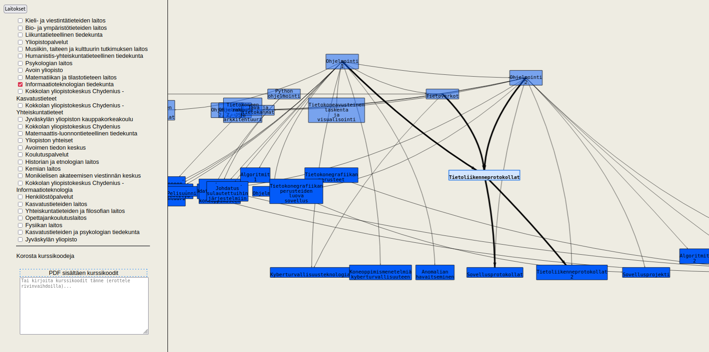

# Yliopiston Kurssien Visualisointisovellus



Tämä sovellus visualisoi yliopiston kursseja ja niiden välisiä esitietoja.

## Online-versio

Voit käyttää sovelluksen online-versiota seuraavassa linkissä:
[Yliopiston kurssien verkostokaavio](http://users.jyu.fi/~tealjapa/ops)

### Käyttö 

Jos haluat ajaa sovellusta paikallisesti omalla koneellasi, seuraa alla olevia ohjeita:

- Asenna Python
- Asenna Flask
- Kopioi kurssisisällöt osoitteesta `http://users.jyu.fi/~tealjapa/ops/reqs.json` ja `http://users.jyu.fi/~tealjapa/ops/courses.json`
    - Tallenna nämä samaan kansioon kuin `server.py`-koodi (haetaan seuraavassa vaiheessa)

### Palvelimen käynnistäminen

0. Kloonaa repo tai lataa lähdekoodi omalle koneellesi komennolla: `git clone https://github.com/teemupaloniemi/courseGraph.git`
1. Siirry kansioon komennolla `cd courseGraph` 
2. Suorita seuraava komento pääteikkunassa palvelimen käynnistämiseksi:

```bash
python server.py
`````
3. Ohjelma on käynnissä osoitteessa http://localhost:5000`
