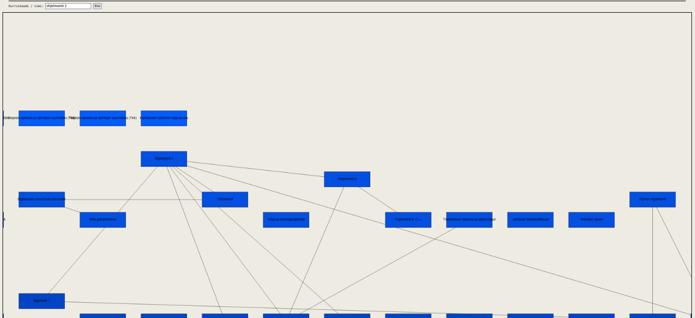

## Online-versio

Voit käyttää sovelluksen online-versiota seuraavassa linkissä (Usean laitoksen yhdistämin puuttuu verkkoversiosta):
[Web-käyttöliittymä](http://users.jyu.fi/~tealjapa/ops)

### Käyttö

0. `git clone --single-branch --depth 1 https://github.com/teemupaloniemi/courseGraph.git`
1. `cd courseGraph`
2. `./start.sh`

tai

2. `pip install -r requirements.txt`  
3. `./download.sh`
4. `./server.py`
   
tai

2. `pip install -r requirements.txt`  
3. `wget http://users.jyu.fi/~tealjapa/ops/courses.json`
   `wget http://users.jyu.fi/~tealjapa/ops/reqs.json`
4. `./server.py`
